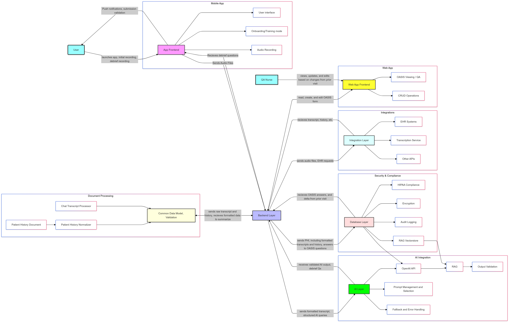

# Design Document: Home Care Nurse OASIS Form Automation App

**Objective:** The Home Care Nurse OASIS Form Automation App leverages advanced Natural Language Processing (NLP) and Artificial Intelligence (AI) to streamline the completion of OASIS forms for home care nurses. By listening to and interpreting nurse-patient interactions, the app extracts relevant clinical data and automatically populates the OASIS form, reducing manual data entry/validation and minimizing errors. Streamlining OASIS assessments and improving care coordination for home health patients. 
 
## Key Features 
**NLP-Powered Transcription and Data Extraction:**
 - Transcription of nurse-patient conversations and dictation.
 - Advanced NLP algorithms to identify and extract relevant clinical data points

**Intelligent OASIS Form Filling:**
 - Mapping of extracted data to corresponding OASIS form fields.
 - AI-driven decision support to ensure accurate and complete form completion.
 - Contextual understanding to handle complex clinical scenarios and variations in 
terminology.
 - Intelligent debriefing to ensure all data is present in the transcript. 

**Historical Data Integration:**
 - Integration with Electronic Health Records (EHRs) and other relevant data 
sources to access patient history and pre-populate OASIS forms with existing 
information.
 - Reduce QA time using a historical record of the patient’s interaction with the 
system

**User-Friendly Interface:**
 - Intuitive and easy-to-use interface for seamless navigation and data entry. 
 - Customizable templates and workflows to adapt to individual nurse preferences 
and agency requirements. 
 - Voice commands and dictation capabilities for hands-free operation. 

**Error Detection and Correction:**
 - Built-in error detection mechanisms to identify inconsistencies and potential 
errors in data entry. 

**Secure Data Storage and Compliance:**
 - HIPAA-compliant data storage and transmission protocols to ensure patient 
privacy and data security. 
 - Role-based access controls to restrict data access to authorized personnel only. 
 - Audit trails to track data changes and maintain accountability. 

## Benefits 
- **Time Savings:** Significantly reduces the time spent on manual OASIS form completion, 
allowing nurses to focus on patient care.
- **Accuracy and Compliance:** Minimizes errors and ensures compliance with OASIS data 
collection standards.
- **Efficiency and Productivity:** Streamlines workflows and improves overall efficiency in 
home care documentation.
- **Data-Driven Insights:** Enables data-driven decision-making and quality improvement 
initiatives through comprehensive data collection and analysis. 

## Technical Architecture 

- **Cloud-Based Platform:** Utilizes a secure cloud-based platform for data storage, 
processing, and compliance with HIPAA
- **NLP and AI Engine:** Integrates advanced NLP and AI algorithms for transcription, data 
extraction, and intelligent form filling. For Example, creating an ontology of headers to 
mark sections in a patient history
- **Data Integration:** Connects with EHRs, billing systems, and other relevant data sources 
through APIs and secure data exchange protocols.
- **Mobile and Web Applications:** Provides user-friendly mobile and web applications for 
seamless access and data entry. 

## Cost Considerations 
**Operational Expenses**
 - API Costs: OpenAI API usage, fallback AI usage, transcription
 - Cloud storage
 - Compute for NLP
 - Monitoring and Alerting
 - Compliance Audits 
**Capital Expenses**
 - Infrastructure Setup
 - Testing/QA/Development 

## Challenges with AI system 
- **Human Judgement Required.** Many of the answers to these questions are based on 
judgment (any severity scores). Would AI defer to the experts here, or would there be an 
allowance for inference? Can we trust AI judgment? If not, how can a system ensure a 
human makes this judgment? Or is there some combination of the two? – See the discussion on Agentic workflows in the `src` directory
- The asynchronous nature of nurse conversation: many questions are answered 
asynchronously (3 words, for example).--perhaps an RL system
- **Nurse Heuristics:** How can the system ensure that visual and mental heuristics that the 
nurses use are accounted for? Perhaps through explicit questioning (on the transcript) or 
through app-based prompts.
- Patient-specific question design. Should AI be used to design follow-up questions that 
would indicate how a specific patient’s conditions are developing?

### Explorative Results

In `./notebooks/loss.ipynb` there is original research into the effectiveness of loss functions on summarization ability, based on user feedback. Because when you're designing a consumer product, you want to ensure that your product iterates based on market feedback

### Modelling Results

In `./notebooks/models.ipynb`, we compare results from closed and open source models. This is important because it allows us to understand the trade-offs between using open source models and closed source models.

### Configurations

`./config` directory is available to store and configure project with variables, values and/or other informations related to project template.

## LICENSE & Contributions

label: A (CONTRIBUTING.md)[CONTRIBUTING.md] file, in your open source repository or site, provides potential project contributors with a short guide to how they can help with your project or study group. It is convention to capitalize the word "contributing" as the file title, and to save it as a resource in markdown (hence the extension .md) (<a href = "https://mozillascience.github.io/working-open-workshop/contributing/">source</a>). :writing_hand: For <b>LICENSE</b> create or add your own file as `LICENSE`.

## Resources

  Based on the AI-ML Project Template by ZenithClown
  <!-- Add badges here -->
  
  
  
  
